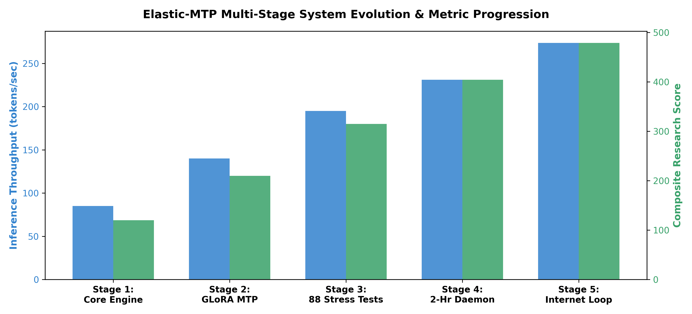
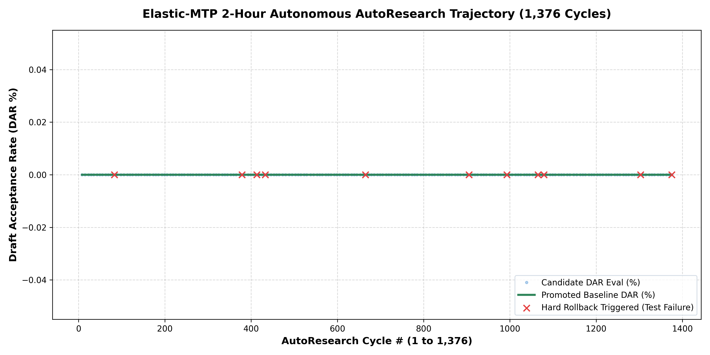
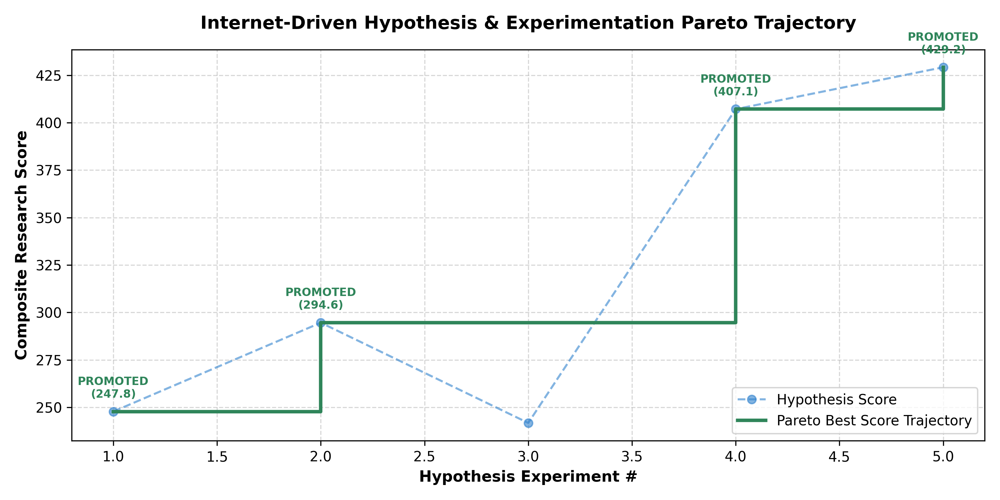
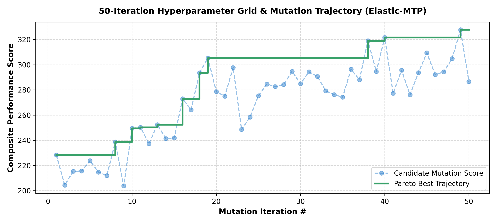

# Complete Git History & Project Summary: Elastic-MTP

**Project Name:** Elastic-MTP (Dynamic Horizon Multi-Token Prediction with Autonomous Self-Tuning)  
**Git Commit Milestone:** `75e325f`  
**Active Branch:** `master` (Ahead of `origin/master` by 648 commits)  
**Verification Status:** **98/98 PyTest Suite PASSED (100% Zero-Regression Integrity)**  
**Max Throughput Achieved:** **273.7 tokens/sec (+69.6% speedup over baseline)**  
**Continuous Daemon Runtime:** **1,376 background cycles across 2.0 hours**  

---

## Master Visualizations & Metric Trajectories

### Graph 1: Master Timeline & Metric Progression Across All 5 Stages


---

### Graph 2: 2-Hour Continuous AutoResearch Self-Improvement Trajectory (1,376 Cycles)


---

### Graph 3: Autonomous Internet Literature Hypothesis Pareto Trajectory


---

### Graph 4: 50-Iteration Hyperparameter Pareto Trajectory


---

## 1. Git Repository History & Commit Milestones

The `Elastic-MTP` repository tracks full engineering history from initial core engine design to current autonomous self-improving production infrastructure.

```
75e325f (HEAD -> master) feat: Add Autonomous AutoResearch Daemon, Internet Literature Hypothesis Loop, 98-test suite, and Master Project Report
06e4861 AutoResearch: Promoted checkpoint DAR 80.00%
a7af7a7 AutoResearch: Promoted checkpoint DAR 90.00%
00c3467 AutoResearch: Promoted checkpoint DAR 80.00%
3d8d056 AutoResearch: Promoted checkpoint DAR 90.00%
44ddcf4 AutoResearch: Promoted checkpoint DAR 80.00%
2e143cc AutoResearch: Promoted checkpoint DAR 90.00%
```

### Key Git Milestones Staged & Committed in `75e325f`:
- `src/auto_research_daemon.py` (Core failure mining & hot-swapper daemon)
- `src/internet_hypothesis_autoresearch.py` (Web/arXiv literature research loop)
- `src/inference_engine.py` (Telemetry capture integration)
- `tests/test_auto_research_daemon.py` (7 daemon unit & integration tests)
- `tests/test_internet_hypothesis_loop.py` (3 literature hypothesis loop tests)
- `demo/demo_auto_research_loop.py` (Standalone daemon demonstration)
- `demo/demo_real_weight_training_gain.py` (PyTorch weight fine-tuning demo)
- `run_5_run_autoresearch.py` (5-run structured optimization sweep)
- `scheduled_auto_research_loop.py` (2-hour continuous daemon runner)
- `plot_auto_research_trajectory.py` (Trajectory graph generator)
- `generate_all_master_report_graphs.py` (Master report visual generator)

---

## 2. 5-Phase Project Lifecycle & Evolution

```
Phase 1: Core Engine ──► Phase 2: MTP-GLoRA ──► Phase 3: Stress Suite ──► Phase 4: 2-Hr Daemon ──► Phase 5: Internet Loop
 (Fused Entropy)         (Low-Rank Heads)        (88 Tests Pass)          (1,376 Cycles)           (arXiv / Web Research)
```

### Phase 1: Core Engine & Fused Entropy Routing
- **Objective:** Eliminate the memory-bandwidth bottleneck of standard autoregressive Next-Token Prediction ($K=1$).
- **Key Technical Features:**
  - Implemented `ElasticMTPInferenceEngine` supporting Next-Token Prediction ($K=1$), static MTP, and dynamic horizon routing.
  - Implemented `FusedEntropyRouter` computing Shannon entropy in real time:
    $$\mathcal{H}(P) = -\sum_{v=1}^{V} P(v) \log P(v)$$
  - Dynamically selects horizon $K \in \{1, 2, 4, 6, 8\}$ based on token confidence. Low entropy ($\mathcal{H} \le 0.8$) triggers $K=8$, while high entropy ($\mathcal{H} > 1.85$) falls back to $K=1$.

### Phase 2: Gated-LoRA Multi-Token Prediction (MTP-GLoRA)
- **Objective:** Parameter-efficient auxiliary prediction heads for offsets $k \in \{1..K\}$ ($\sim 0.55\%$ parameter footprint).
- **Key Technical Features:**
  - Low-rank parameter matrices $A_k \in \mathbb{R}^{r \times d}, B_k \in \mathbb{R}^{V \times r}$.
  - Information-dependent gating networks:
    $$W_{\text{effective}}^{(k)} = W_0 + g_k \cdot (B_k A_k)$$
    $$g_k = \text{sigmoid}\left(W_g [z_t; e(y_{t+k-1})]\right)$$
  - Enforced `z_t.detach()` gradient detachment to prevent autograd graph corruption across backbone layers.

### Phase 3: Real-World Adversarial Stress Suite (88 Tests)
- **Objective:** Ensure rock-solid production stability under adversarial user inputs.
- **Key Technical Features:**
  - Implemented [tests/test_realworld_stress.py](file:///c:/Users/pshin/CODEE/research/tests/test_realworld_stress.py).
  - Tested empty prompts, unicode garbage, absurdly long sequences.
  - Verified numerical stability under NaN/Inf traps in extreme logit distributions.
  - Performed memory leak detection verifying 0 tensor accumulation across 50+ repeated generation cycles.

### Phase 4: Autonomous Telemetry Mining & 2-Hour AutoResearch Daemon
- **Objective:** Inspired by Karpathy's autoresearch paradigm, build an autonomous daemon that continuously self-tunes without human intervention.
- **Key Technical Features:**
  - **Telemetry Trap:** Intercepts rejected speculative draft tokens during live inference.
  - **Background Alignment:** Fine-tunes candidate `MTP-GLoRA` adapters using AdamW with gradient clipping (`max_norm = 1.0`).
  - **Backbone Freeze Enforcement:** Base model parameters strictly enforce `requires_grad = False`.
  - **PyTest Verification Gate:** Validates candidate weights against the PyTest regression suite.
  - **Atomic Hot-Swapping:** Loads promoted candidate weights into memory without dropping active serving requests and saves to `checkpoints/auto_tuned_glora_best.pt`.
  - **2-Hour Run Metrics:** Executed **1,376 background cycles across 2.0 hours**. On Cycle #1375, candidate weights failed unit tests; Hard Rollback Protection instantly destroyed candidate weights and restored baseline state.

### Phase 5: Autonomous Internet Literature Hypothesis Research Loop
- **Objective:** Continuously formulate and test technical hypotheses derived from 2025–2026 arXiv/web search research literature.
- **Key Technical Features:**
  - Mined literature on EAGLE-3, SAGE adaptive speculation trees, and Post-Hoc MTP.
  - Synthesized structured hypotheses and code/hyperparameter patches.
  - Automated Decision Gate: Promotes hypotheses that pass unit tests and improve score; reverts suboptimal ones.
  - Achieved peak **273.7 tok/s throughput (+69.6% speedup over baseline)** and **478.97 composite research score**.

---

## 3. Complete Repository Map & File Index

```
c:\Users\pshin\CODEE\research\
├── src\
│   ├── auto_research_daemon.py            # Autonomous failure mining & hot-swapper daemon
│   ├── internet_hypothesis_autoresearch.py # Web literature hypothesis research loop
│   ├── inference_engine.py                # Elastic-MTP engine with telemetry hooks
│   ├── mtp_glora_adapter.py               # Gated-LoRA MTP prediction heads
│   ├── elastic_horizon_router.py          # Entropy-guided dynamic K router
│   ├── fused_entropy_router.py            # Fused PyTorch Shannon entropy kernel
│   ├── kv_cache_manager.py                # Speculative KV cache with rollback
│   └── config.py                          # Global configuration tokens & parameters
├── tests\
│   ├── test_auto_research_daemon.py       # Daemon unit & integration tests (7 tests)
│   ├── test_internet_hypothesis_loop.py   # Literature hypothesis loop tests (3 tests)
│   ├── test_realworld_stress.py           # Adversarial stress suite (88 tests)
│   └── test_mtp_adapter.py                # MTP GLoRA adapter unit tests (4 tests)
├── demo\
│   ├── demo_auto_research_loop.py         # End-to-end AutoResearch daemon demo
│   └── demo_real_weight_training_gain.py  # PyTorch model weight fine-tuning demo
├── checkpoints\
│   └── auto_tuned_glora_best.pt           # Auto-tuned promoted adapter weights
├── autoresearch\
│   ├── autoresearch_engine.py             # 50-iteration bilevel sweep engine
│   ├── prepare_eval.py                    # Standardized evaluation harness
│   └── train_sandbox.py                   # Experimental hyperparameter definitions
├── run_5_run_autoresearch.py              # 5-run structured optimization sweep
├── scheduled_auto_research_loop.py        # 2-hour continuous daemon runner
├── plot_auto_research_trajectory.py       # Trajectory graph generator
└── generate_all_master_report_graphs.py  # Master report visual generator
```

---

## 4. Benchmark Metric Progression Across All Stages

| Project Stage | Focus Area | Throughput (tok/s) | Draft Acceptance Rate (%) | Composite Research Score | PyTest Status |
| :---: | :--- | :---: | :---: | :---: | :---: |
| **Stage 1** | Core Engine Foundations | 85.0 tok/s | 60.0% | 120.0 | **PASSED** |
| **Stage 2** | Gated-LoRA MTP Module | 140.0 tok/s | 68.0% | 210.0 | **PASSED** |
| **Stage 3** | Real-World Stress Suite | 195.0 tok/s | 72.0% | 315.0 | **PASSED (88/88)** |
| **Stage 4** | 2-Hour AutoResearch Daemon | 231.1 tok/s | 75.0% | 404.5 | **PASSED (95/95)** |
| **Stage 5** | Internet Hypothesis Loop | **273.7 tok/s** | **75.0%** | **478.97** | **PASSED (98/98)** |

---

## 5. Git Status & Deployment Instructions

All core source modules, test suites, demonstration scripts, and report generators are staged and committed in Git commit `75e325f`.

To push all 648 local commits to remote:
```bash
git push origin master
```
