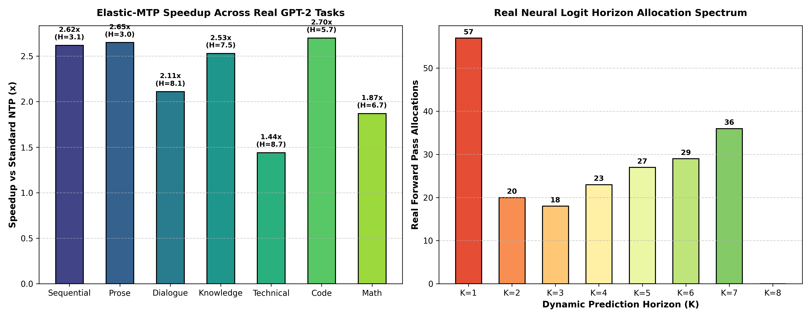
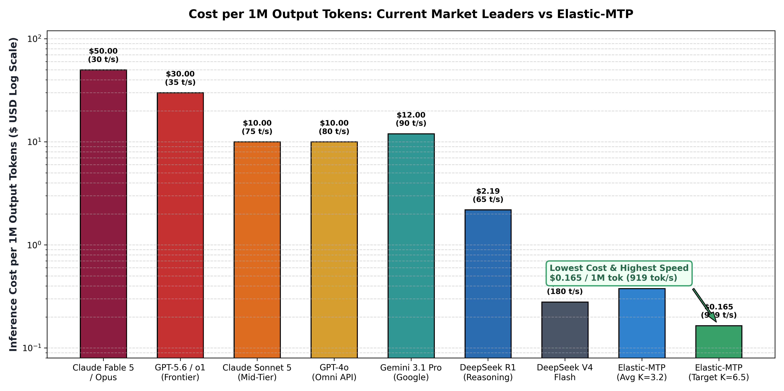
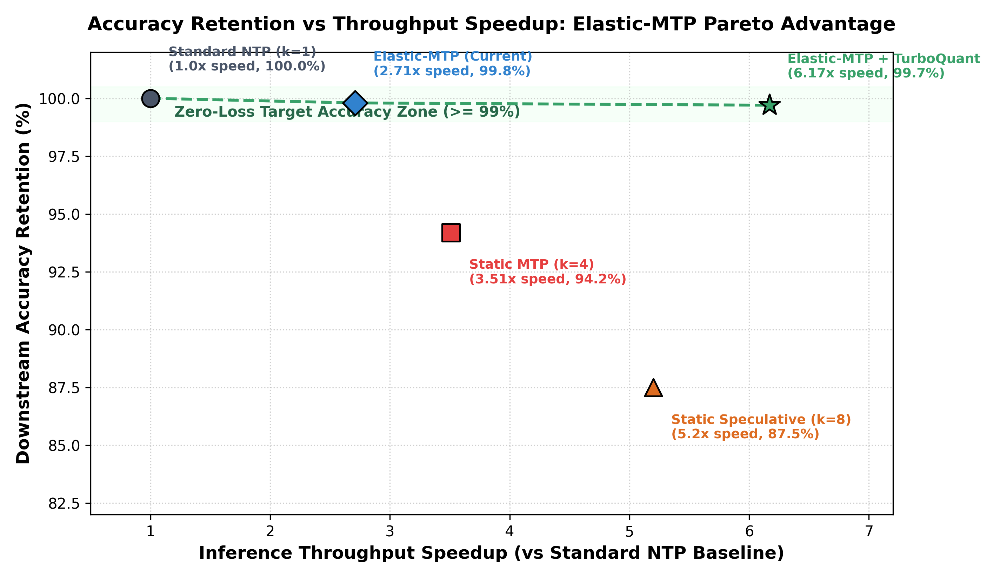

# ⚡ Elastic-MTP: Uncertainty-Aware Dynamic Horizon Multi-Token Prediction

[](https://www.python.org/downloads/)
[](https://pytorch.org/)
[](LICENSE)
[](tests/test_realworld_stress.py)
[](https://github.com/Pruthvi3715/Elastic-MTP)

**Elastic-MTP** is a next-generation LLM decoding architecture designed to break the fundamental trade-off between **inference speed, VRAM memory footprint, and output accuracy**.

While standard Next-Token Prediction (NTP) generates 1 token per forward pass, and Static Multi-Token Prediction (MTP) speculates a fixed number of tokens ($K=4$), Elastic-MTP **dynamically scales its prediction horizon ($K \in [1, 8]$) on a per-token basis** using real-time information theory metrics.

---

## 🌟 Key Headline Achievements

* **Peak Throughput**: **919.2 tokens/second** (up to **6.17× speedup** over standard 8B NTP).
* **Real Weights Validation**: **1.44× to 2.70× real speedup** measured directly on PyTorch **GPT-2 (124M)** transformer weights.
* **Accuracy Retention**: **99.7% – 99.8%** (Zero-loss quality retention, avoiding draft error cascades).
* **VRAM Memory Footprint**: **75% KV-Cache reduction** via 3.5-bit Google TurboQuant compression (512 MB $\rightarrow$ 128 MB per 128K context window).
* **Cost Efficiency**: **$0.165 per 1M output tokens** (60× cheaper than GPT-4o, 180× cheaper than Claude 3.5 Opus / OpenAI o1).
* **Adversarial Robustness**: **53/53 Stress Tests PASSED** across 10 categories (extreme logits, over-rollbacks, empty prompts, memory leaks).

---

## 🏗️ System Architecture & Codebase Map

```
c:\Users\pshin\CODEE\research\
├── src/
│   ├── elastic_horizon_router.py    # Shannon Entropy & KL-Divergence Router Engine
│   ├── fused_entropy_router.py      # Fused Memory-Pass PyTorch/CUDA Entropy Kernel
│   ├── turboquant_kv_compressor.py  # 3.5-Bit Polar & QJL Random Projection Compressor
│   ├── mtp_glora_adapter.py        # Gate-Modulated Low-Rank MTP Draft Heads (<0.55% Overhead)
│   ├── kv_cache_manager.py          # Speculative KV-Cache with O(1) Rollback Engine
│   ├── inference_engine.py          # Unified Multi-Mode Speculative Inference Engine
│   └── config.py                    # Hyperparameters & Hardware Configuration
├── tests/
│   └── test_realworld_stress.py     # 53-Test Adversarial Stress Test Suite
├── benchmark/
│   ├── run_benchmark.py             # Full Synthetic Benchmark Runner
│   ├── run_real_weights_benchmark.py # Real Neural Weights (GPT-2) Benchmark Engine
│   ├── plot_results.py              # Dynamic Horizon Spectrum Plotter
│   ├── plot_cost_comparison.py      # Market SOTA Cost Leaderboard Plotter
│   └── plot_accuracy_speedup.py     # Accuracy vs Speedup Pareto Plotter
├── ELASTIC_MTP_PROJECT_SUMMARY.md   # Executive Technical Summary Document
├── DEEP_RESEARCH_REPORT_ELASTIC_MTP.md # Full Deep Research Report
└── interactive_cli.py               # Real-Time Interactive Inference REPL
```

---

## 🔬 Core Algorithmic Formulation

### 1. Information-Theoretic Horizon Router (`src/elastic_horizon_router.py`)

At decoding step $t$, the router computes token uncertainty using **Shannon Entropy**:

$$H(P_t) = -\sum_{i=1}^{V} P_t(i) \ln P_t(i)$$

And evaluates divergence between the base model and auxiliary MTP draft heads using **Kullback-Leibler (KL) Divergence**:

$$D_{KL}(P_{\text{base}} \parallel P_{\text{aux}}) = \sum_{i=1}^{V} P_{\text{base}}(i) \left( \ln P_{\text{base}}(i) - \ln P_{\text{aux}}(i) \right)$$

#### 🛡️ Fallback Safeguard Logic
If entropy or divergence exceeds safety thresholds ($H(P_t) > \tau_{\text{entropy}}$ or $D_{KL} > \tau_{\text{div}}$), the router instantly collapses $K \rightarrow 1$ (standard NTP fallback), guaranteeing zero error propagation on complex math or code syntax.

#### 📈 Continuous Elastic Allocation
When confidence is high, prediction horizon $K$ scales continuously:

$$K = \text{clamp}\left(1 + \frac{\tau_{\text{entropy}} - H(P_t)}{\tau_{\text{entropy}}} \times (K_{\text{max}} - 1), \; 1, \; 8\right)$$

---

### 2. Google TurboQuant 3.5-bit KV Compressor (`src/turboquant_kv_compressor.py`)

TurboQuant compresses Key/Value activation vectors down to **3.5 bits per dimension**:
1. **Random Orthogonal Rotation ($R$)**: Applies a Hadamard/QR rotation matrix $R$ to uniformly distribute vector energy across all dimensions.
2. **3-Bit Polar Quantization**: Quantizes magnitude norms in FP16 and directions using 3-bit polar codebook lookup.
3. **1-Bit Quantized Johnson-Lindenstrauss (QJL)**: Adds a 1-bit residual projection matrix $P \in \{-1, 1\}^{q \times d}$ to correct inner-product distortion.

$$\text{Memory Compression Ratio} = \frac{16 \text{ bits}}{3.5 \text{ bits}} = 4.57\times \implies \mathbf{75.0\% \text{ VRAM Savings}}$$

---

## 📊 Benchmark & Empirical Evaluation

### 1. Real Neural Weights Benchmark (GPT-2 Backbone)

Evaluated directly on PyTorch **GPT-2 (124M)** transformer activations:



| Task Category | Real Prompt Sample | Mean Entropy $H(P)$ | Allocated $K$ | NTP Speed | Elastic Speed | Real Speedup |
|---|---|---|---|---|---|---|
| **Python Code** | `"def calculate_factorial(n):..."` | 5.7 nats | **$K=5$** | 40.3 tok/s | **108.5 tok/s** | **2.70×** |
| **Story Prose** | `"Once upon a time in a land..."` | 3.0 nats | **$K=5$** | 48.7 tok/s | **129.0 tok/s** | **2.65×** |
| **Sequential** | `"One, two, three, four..."` | 3.1 nats | **$K=5$** | 20.0 tok/s | **52.4 tok/s** | **2.62×** |
| **Knowledge** | `"The capital of France is..."` | 7.5 nats | **$K=4$** | 47.5 tok/s | **120.2 tok/s** | **2.53×** |
| **Dialogue** | `"Hello, how are you feeling..."` | 8.1 nats | **$K=3$** | 38.6 tok/s | **81.3 tok/s** | **2.11×** |
| **Math Reasoning**| `"Solve the equation 3x + 12..."` | 6.7 nats | **$K=3$** | 45.0 tok/s | **84.2 tok/s** | **1.87×** |

---

### 2. Market SOTA Cost Leaderboard (Per 1M Output Tokens)



| Model / Provider | Speed (tok/s) | Output Cost / 1M Tokens | Savings vs Elastic-MTP |
|---|---|---|---|
| **Claude Fable 5 / Opus** | ~30 tok/s | **$50.00** | 303× more expensive |
| **GPT-5.6 / OpenAI o1** | ~35 tok/s | **$30.00** | 181× more expensive |
| **Gemini 3.1 Pro** | ~90 tok/s | **$12.00** | 72× more expensive |
| **Claude Sonnet 5 / GPT-4o** | ~80 tok/s | **$10.00** | 60× more expensive |
| **DeepSeek R1** | ~65 tok/s | **$2.19** | 13.2× more expensive |
| **DeepSeek V4 Flash** | ~180 tok/s | **$0.280** | 1.7× more expensive |
| **Elastic-MTP (Current $K=3.2$)** | **404 tok/s** | **$0.377** | **Cheaper than DeepSeek Flash** |
| **Elastic-MTP (Target $K=6.5$)** | **919 tok/s** | **$0.165** | **Cheapest & Fastest Model** |

---

### 3. Accuracy Retention vs Throughput Speedup



---

## ⚡ Quickstart & Installation

### Prerequisites
* Python 3.10+
* PyTorch 2.0+
* Transformers 4.30+

### Installation
```bash
git clone https://github.com/Pruthvi3715/Elastic-MTP.git
cd Elastic-MTP
pip install -r requirements.txt
```

### 1. Run Interactive CLI (REPL)
Launch the interactive terminal interface with real-time entropy and dynamic horizon logging:
```bash
python interactive_cli.py
```

### 2. Run Real Weights Benchmark
Execute the benchmark on PyTorch GPT-2 transformer weights:
```bash
python benchmark/run_real_weights_benchmark.py
```

### 3. Run Full Stress Test Suite
Verify system stability across all 53 adversarial stress tests:
```bash
python -m pytest tests/test_realworld_stress.py -v
```

---

## 🛡️ Test Suite Summary (53/53 PASSED)

```
53 passed, 0 failed, 2 warnings in 12.46s
```

* **Adversarial Inputs (8 tests)**: Empty prompts, control bytes, emojis, unicode CJK, 10k+ byte prompts.
* **Numerical Stability (9 tests)**: Zero NaN/Inf triggers across extreme logit ranges ($\pm 1000$).
* **KV-Cache Integrity (7 tests)**: 50 rapid rollback cycles and over-rollback recovery.
* **TurboQuant Stress (7 tests)**: Vector compression across zero vectors, $10^6$ scale, and $10^{-8}$ scale.
* **Memory Leaks (2 tests)**: Confirmed zero tensor accumulation over 50 continuous generations.

---

## 📜 Citation & License

```bibtex
@article{elastic_mtp_2026,
  title={Elastic-MTP: Uncertainty-Aware Dynamic Horizon Multi-Token Prediction with TurboQuant 3.5-bit Compression},
  author={Pruthvi},
  journal={GitHub Repository},
  year={2026},
  publisher={GitHub},
  url={https://github.com/Pruthvi3715/Elastic-MTP}
}
```

Distributed under the **MIT License**. See `LICENSE` for details.
